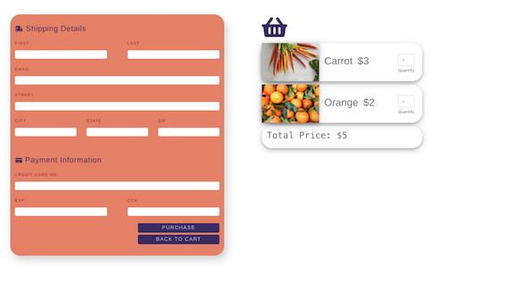

# RowdyCart

> RowdyCart is a one-stop grocery shop containing a catalog of grocery items to fit your everyday needs, also help UTSA students stay healthy. We wanted to make the process of getting groceries as painless as possible. **Currently not mobile friendly yet.** 





## Installation


```sh

git clone https://github.com/e76971072/RowdyCart-User-Interface.git

npm install or npm -i 

npm start  ( by default localhost:3000)
```


## Development setup


Describe how to install all development dependencies and how to run an automated test-suite of some kind. Potentially do this for multiple platforms.


```sh

make install

npm test

```


## Release History
- Please refer to  [this ](https://github.com/e76971072/CUSTOMER-PORTAL) to see our development process.  
- 3 branches: 
		**- Backend brach (FLASK):** handling HTTP requests from client, storing data using PhpMySql
		**- Frontend branch (React)**: Focusing on UI/UX
		- **Master branch** : Merged both branches to go into production. 


## Meta


Kevin Nguyen – [My Website](https://kevinnguyen.team) – an.nguyen1197@gmail.com


## Contributing


1. Fork it (<https://github.com/e76971072/RowdyCart-User-Interface.git>)

2. Create your feature branch (`git checkout -b yourbranch`)

3. Commit your changes (`git commit -am 'Add some thing'`)

4. Push to the branch (`git push origin feature/fooBar`)

5. Create a new Pull Request


<!-- Markdown link & img dfn's -->

[npm-image]: https://img.shields.io/npm/v/datadog-metrics.svg?style=flat-square

[npm-url]:https://www.npmjs.com/package/latest-version](https://www.npmjs.com/package/latest-version)

[npm-downloads]: https://img.shields.io/npm/dm/datadog-metrics.svg?style=flat-square

[travis-image]: https://img.shields.io/travis/dbader/node-datadog-metrics/master.svg?style=flat-square

[travis-url]: https://travis-ci.org/dbader/node-datadog-metrics

[wiki]: https://github.com/yourname/yourproject/wiki%